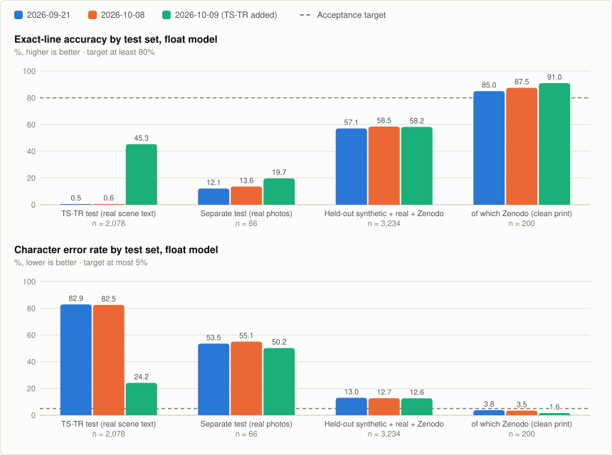
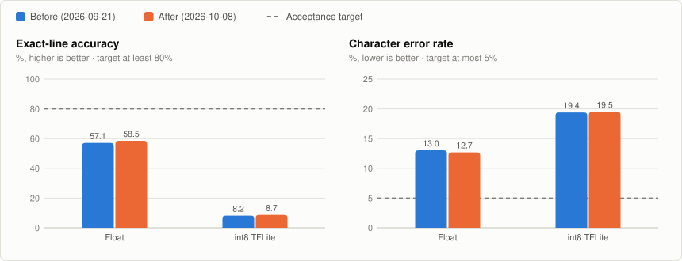
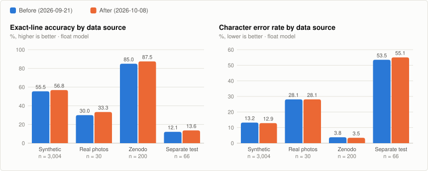
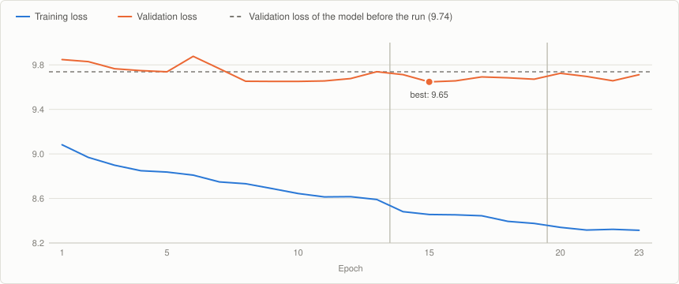
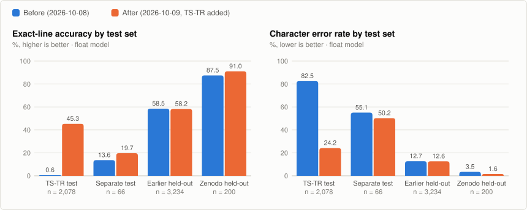
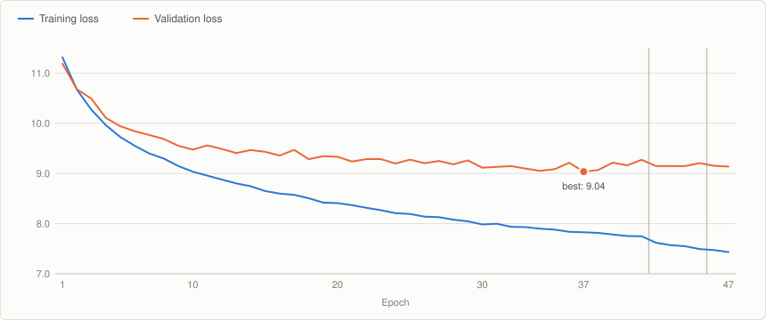

# Turkish TinyML Line OCR

A compact, full-int8 CNN-CTC recognizer for a single horizontal line of
printed Turkish text, sized to eventually run on a microcontroller-class
embedded target. It started as part of the
[makeshift-flipper](https://github.com/ErdemWilkinson/makeshift-flipper)
project and was split out of that firmware repo
because it's a separate concern (Python/TensorFlow training pipeline vs.
ESP-IDF C firmware) with its own, much larger dataset.

**Status: training pipeline works end-to-end; not yet integrated into any
firmware.** The float model reads 45% of unseen real scene-text crops and
58% of held-out synthetic/printed lines exactly; the int8 export still
loses most of that accuracy. See [Hardware integration status](#hardware-integration-status)
below for exactly what's blocking integration and what's already decided.

## Where the model stands

Three versions of the same model, each trained from the previous one's
weights, scored on data none of them was trained on (last update:
2026-10-09).

<picture>
  <source media="(prefers-color-scheme: dark)" srcset="docs/ocr-progress-dark.svg">
  
</picture>

Exact-line accuracy, float model:

| Test set | Samples | 2026-09-21 | 2026-10-08 | 2026-10-09 | Target |
|---|---:|---:|---:|---:|---:|
| TS-TR official test split (real scene text) | 2078 | 0.53% | 0.58% | **45.33%** | ≥ 80% |
| Separate test, `test_labels.csv` (real photos) | 66 | 12.12% | 13.64% | **19.70%** | ≥ 80% |
| Held-out synthetic + real + Zenodo | 3234 | 57.08% | 58.50% | 58.23% | ≥ 80% |
| of which Zenodo (clean print) | 200 | 85.00% | 87.50% | **91.00%** | ≥ 80% |

Character error rate, float model:

| Test set | Samples | 2026-09-21 | 2026-10-08 | 2026-10-09 | Target |
|---|---:|---:|---:|---:|---:|
| TS-TR official test split (real scene text) | 2078 | 82.86% | 82.53% | **24.17%** | ≤ 5% |
| Separate test, `test_labels.csv` (real photos) | 66 | 53.54% | 55.06% | **50.21%** | ≤ 5% |
| Held-out synthetic + real + Zenodo | 3234 | 13.03% | 12.69% | 12.61% | ≤ 5% |
| of which Zenodo (clean print) | 200 | 3.79% | 3.45% | **1.61%** | ≤ 5% |

What changed between versions:

- **2026-09-21 -> 2026-10-08:** 23 more epochs on the same data. Almost no
  effect; more training time alone was not the lever.
- **2026-10-08 -> 2026-10-09:** 5,206 real scene-text crops (TS-TR) added.
  The model learned a kind of text it could not read at all, without losing
  accuracy elsewhere. Real-world data was the lever.

What is still open:

- **int8 quantization.** The exported int8 model reads 10.5% of the 3,993
  held-out samples exactly, against 55.7% for the float model it was made
  from. This gap predates all three versions and blocks on-device use.
- **The acceptance bar.** Only clean printed Zenodo lines meet it.
- **Small real-photo test.** The 66-line set moves by a few lines per
  version; it is too small to rank models on its own.

Details of each run are under [Results](#results).

## Why a custom model instead of an existing OCR package

This was a deliberate choice, made before any training code was written —
see [DECISION_NOTES.md](DECISION_NOTES.md) for the full reasoning. Short
version: PaddleOCR/PP-OCR and similar general OCR stacks assume a phone or
a real application processor, not a memory-constrained MCU; Tesseract isn't
a TinyML model at all; and per-character classification breaks on kerning,
accents, and variable spacing. A small grayscale CNN + CTC sequence
recognizer for one pre-cropped text line is the smallest model that still
handles variable-length Turkish text correctly.

## Model

- Input: `160 x 32 x 1` grayscale image (one cropped, mostly-horizontal
  text line)
- Architecture: 4 conv+batchnorm+pool blocks → 2-layer BiLSTM → dense
  softmax over the character set (see `scripts/train.py`'s `build_models()`)
- Output: per-timestep character logits (40 timesteps — `IMAGE_WIDTH // 4`,
  matching the two width-reducing stride-2 pools), including a CTC blank
  class
- Character set (`ALPHABET` in `scripts/train.py`): digits, ASCII
  upper/lowercase, the Turkish letters `ç ğ ı İ ö ş ü Ç Ğ Ö Ş Ü`, a space,
  and `.,:;!?-_/()'%`. Max decoded text length: 24 characters.
- Decoder: greedy CTC (argmax per timestep + collapse repeats/blanks) —
  no beam search in this version, deliberately, to keep post-processing
  trivial on-device
- Quantization: full int8 (weights, activations, input, output) via
  `scripts/export_tflite.py`
- Text line detection/cropping is **not** part of this model — classical
  preprocessing (thresholding, morphology, connected components) is
  expected to produce the line crop before this model ever runs. No
  neural detector in this version; see `DECISION_NOTES.md` §4 for why.

## Repository layout

```text
ocr/
├── scripts/
│   ├── generate_synthetic.py    # builds data/lines/synthetic/ + labels.csv rows
│   ├── prepare_real_lines.py    # crops real document photos into labeled lines
│   ├── import_zenodo_dataset.py # Zenodo printed lines -> data/zenodo_lines/
│   ├── import_tstr_dataset.py   # TS-TR scene-text crops -> data/tstr_lines/
│   ├── train.py                 # trains the CNN-CTC model, writes artifacts/
│   ├── evaluate.py               # CER + exact-line accuracy on held-out groups
│   ├── make_representative.py   # rebuilds the int8 calibration sample set
│   ├── export_tflite.py         # float .keras -> full-int8 .tflite
│   ├── evaluate_tflite.py       # scores the exported .tflite on the held-out split
│   └── gradio_demo.py           # local demo UI for trying the model on an image
├── data/
│   ├── wordlists/tr_50k.txt      # tracked: small (~700KB) input corpus
│   ├── lines/, real_lines/,      # NOT tracked: generated/derived/imported images
│   │   zenodo_lines/, tstr_lines/
│   └── *labels.csv               # NOT tracked: one manifest per source (image,text,group)
├── artifacts/
│   ├── alphabet.json             # tracked: the character set, hand-decided
│   └── *.keras, *.tflite, *.npy  # NOT tracked: trained model outputs
├── docs/                         # tracked: result charts embedded in this README
├── DECISION_NOTES.md             # the model-selection writeup, moved here from
│                                  # the firmware repo's OCR_TINYML_NOTES.md
├── MODEL_LICENSE.md              # terms for trained models (separate from the MIT code license)
└── requirements-train.txt
```

**What's tracked in git and what isn't:** only code, the wordlist corpus,
and the alphabet config are tracked. All generated/derived data (synthetic
line images, real-photo crops, the training manifest, and every trained
model artifact) is gitignored — regenerate it locally with the commands
below. This keeps the repo small and avoids committing personal training
photos.

## Dataset layout

```text
ocr/data/lines/<split>/<id>.png
ocr/data/labels.csv
```

`labels.csv` columns: `image,text,group`.

```csv
image,text,group
lines/train/000001.png,İstanbul,generated_font_01
lines/train/000002.png,şifre 123,phone_photo_01
```

`group` drives the train/validation split (`GroupShuffleSplit` in
`train.py`, 15% held out): images from the same font/background/source
group must never appear in both splits, or validation numbers become
optimistic. `train.py` enforces at least 2 distinct groups and rejects any
row whose text is empty, over 24 characters, or contains a character
outside `ALPHABET`.

Images should contain one mostly horizontal printed text line, and the
dataset overall should cover Turkish diacritics, upper/lowercase, punctuation,
blur, perspective distortion, uneven lighting, sensor noise, and a few
invalid/empty crops (so the model learns what "no usable text" looks like,
not just clean lines).

### Building the dataset

Four sources are scripted (nothing here is committed pre-built); only the
first writes `data/labels.csv`, the others each write their own manifest:

1. **Synthetic** (`scripts/generate_synthetic.py`): renders 18,000 lines
   from `data/wordlists/tr_50k.txt` using PIL, with randomized fonts,
   backgrounds, blur, and perspective (fixed `random.Random(42)` seed for
   reproducibility). Writes to `data/lines/synthetic/` and appends to
   `labels.csv`.
2. **Real** (`scripts/prepare_real_lines.py`): takes photographed document
   pages (not tracked in this repo — keep them locally, e.g. in a personal
   `eğitim verisi/`-style folder outside version control) and crops them
   into individual line images plus a preliminary transcription pass under
   `data/real_lines/`, writing a **separate** manifest,
   `data/real_labels.csv` — it does **not** merge into `labels.csv`
   automatically. To actually train on both, point `train.py` at both
   manifests via `OCR_LABELS_CSV` (see "Training pipeline" below); running
   `prepare_real_lines.py` alone, without also setting that variable, does
   not add real photos to a plain `python scripts/train.py` run.
   `train.py`'s representative-sample logic specifically balances real vs.
   synthetic samples (`row["image"].startswith("real_lines/")`) so the
   int8 calibration set isn't all-synthetic — but only once
   `OCR_LABELS_CSV` actually includes `real_labels.csv`.

3. **Zenodo** (`scripts/import_zenodo_dataset.py`): the printed subsets of
   the Turkish OCR Text Image Dataset, written to `data/zenodo_lines/` and
   `data/zenodo_labels.csv`.
4. **TS-TR** (`scripts/import_tstr_dataset.py`): cropped real-world scene
   text (signs, shop fronts, plates). Download and extract the Kaggle
   archive, then run the importer with `--source <folder holding train.txt>`.
   Its official train split becomes `data/tstr_labels.csv` (5,206 usable
   crops); its official test split is kept apart as the evaluation-only
   `data/tstr_test_labels.csv` (2,078 crops). Like the real-photo manifest,
   neither is merged into `labels.csv` -- add them through `OCR_LABELS_CSV`.

### Third-party data and licenses

None of this data is redistributed in this repository; each source keeps
its own license, and attribution is required where the license says so.

| Dataset | Used for | License | Source |
|---|---|---|---|
| Turkish word-frequency list (`data/wordlists/tr_50k.txt`) | Text for synthetic lines | Original license of the list | Tracked in this repo |
| Turkish OCR Text Image Dataset | Training (printed lines) | CC BY 4.0 | [Zenodo record 21923181](https://zenodo.org/records/21923181) |
| Turkish Scene Text Recognition (TS-TR), Serdar Yıldız | Training and evaluation (real scene text) | **CC BY-NC 4.0** | [Kaggle](https://www.kaggle.com/datasets/serdaryildiz/turkish-scene-text-recognition-dataset), [MViT-TR repository](https://github.com/serdaryildiz/MViT-TR) |

TS-TR is non-commercial. A model trained with it inherits that restriction;
see [MODEL_LICENSE.md](MODEL_LICENSE.md).

## Training pipeline

From this directory, in a Python 3.11 environment:

```powershell
py -3.11 -m venv .venv
.\.venv\Scripts\Activate.ps1
pip install -r requirements-train.txt

python scripts\generate_synthetic.py     # builds the synthetic split, writes data\labels.csv
python scripts\prepare_real_lines.py     # optional: only if you have real photos locally, writes data\real_labels.csv (SEPARATE from labels.csv)

# Synthetic only (the default -- prepare_real_lines.py's output is ignored unless OCR_LABELS_CSV is set):
python scripts\train.py

# Synthetic + real merged (only way to actually train on both; PowerShell uses ; as the separator):
$env:OCR_LABELS_CSV = "data\labels.csv;data\real_labels.csv"
python scripts\train.py

# Everything, as used for the current model (after running the two import_* scripts):
$env:OCR_LABELS_CSV = "data\labels.csv;data\real_labels.csv;data\zenodo_labels.csv;data\tstr_labels.csv"
python scripts\train.py

python scripts\evaluate.py --labels labels.csv                   # CER + exact-line accuracy on a held-out split
python scripts\evaluate.py --labels tstr_test_labels.csv --full  # every row of an evaluation-only manifest
python scripts\make_representative.py    # rebuilds the int8 calibration sample set
python scripts\export_tflite.py          # writes artifacts/turkish_line_ocr_int8.tflite
python scripts\evaluate_tflite.py        # sanity-checks the quantized model
```

`train.py` respects two environment variables if you want to point it at a
different manifest/output location without editing the script:
`OCR_LABELS_CSV` (colon/semicolon-separated list of `labels.csv` paths,
useful for combining datasets) and `OCR_ARTIFACTS` (output directory,
defaults to `artifacts/`).

Four more optional variables control a continuation run:

- `OCR_WARM_START`: path to an existing `turkish_line_ocr.keras`; training
  continues from its weights instead of starting from random ones. Point it
  at a copy outside `OCR_ARTIFACTS`, since the run overwrites the model there.
- `OCR_LR`: initial learning rate (default `1e-3`; a continuation run
  usually wants something lower, e.g. `3e-4`).
- `OCR_MAX_MINUTES`: time budget for the fit. Training stops before an epoch
  that would not fit and saves the weights of the best-`val_loss` epoch.
- `OCR_FIXED_VALIDATION`: path to an earlier run's `split_manifest.json`.
  That run's held-out rows stay held out, and only data sources it never
  saw get a fresh 15% group split. Use it when a warm-started run adds a
  dataset: re-drawing the split would move rows the model already trained
  on into validation.

Training uses `Adam(1e-3)` with gradient clipping, early stopping on
validation loss (patience 10), and LR halving on plateau (patience 4) — up
to 150 epochs, whichever early-stopping hits first.

## Acceptance targets

Before any of this is treated as ready to integrate into firmware, on a
source/font/background-independent held-out set:

- Turkish character error rate (CER): ≤ 5%
- Exact-line accuracy: ≥ 80% for short controlled lines
- No unsupported operators in the target embedded TFLite runtime
- Model + tensor arena size measured on real target hardware, not guessed
- First-pass latency target: ≤ 1 second per cropped line

`scripts/evaluate.py` reports CER and exact-line accuracy; the tables below
use the held-out rows `train.py` records in `artifacts/split_manifest.json`
and evaluation-only manifests no run has trained on.

## Results

The sections below are in chronological order; [Where the model stands](#where-the-model-stands)
at the top of this README summarizes the latest numbers.

### Baseline (2026-09-20, `data/labels.csv`, 3681 held-out samples)

```
python scripts/evaluate.py --labels labels.csv
```

- Character error rate: **13.09%** (target: ≤ 5%)
- Exact-line accuracy: **57.35%** (target: ≥ 80%)

**Not yet at the acceptance bar, but not unusable either.** Most errors in
the sample predictions are small — a dropped trailing word/character or a
digit substitution (`"akl'ma buraday'm yapmas'"` → `"akl'ma buraday' 2"`),
not wholesale garbage. This reads as an undertrained/underfit baseline
(more epochs, more synthetic data variety, or real-photo fine-tuning are
the obvious next levers) rather than an architecture that doesn't work at
all — contrast this with `voice/`'s CTC baseline (Round 17 in
`KNOWN_ISSUES.md`), which produces character soup, not near-misses. This
number has not been re-measured against a real device-representative test
set (only the training pipeline's own synthetic held-out split, generated
by the same process as the training data — see `DECISION_NOTES.md` for
why that's a weaker signal than font/background/source-independent data
would be).

### Continuation run (2026-10-08, 3234 held-out samples from `split_manifest.json`)

The 2026-09-21 model was trained for another 23 epochs (`OCR_WARM_START`,
`OCR_LR=3e-4`, `OCR_MAX_MINUTES=54`) on `labels.csv` + `real_labels.csv` +
`zenodo_labels.csv`, with the same group split. Both models were scored on
that split's held-out rows:

| Model | CER | Exact-line accuracy |
|---|---:|---:|
| Float, before (2026-09-21) | 13.03% | 57.08% |
| Float, after (2026-10-08) | 12.69% | 58.50% |
| int8 TFLite, before | 19.4% | 8.2% |
| int8 TFLite, after | 19.5% | 8.7% |

<picture>
  <source media="(prefers-color-scheme: dark)" srcset="docs/ocr-before-after-dark.svg">
  
</picture>

A small gain, still short of the acceptance bar. The int8 model loses most
of its exact-line accuracy relative to the float model in both versions, so
quantization, not training time, is the larger open problem: sample
predictions mostly drop trailing characters (`'kaptan 01'` -> `'kaptan 0'`).

#### By data source (float model)

The first three rows split the 3234 held-out samples by where the line came
from. The last row is `test_labels.csv`, 66 real lines that no training run
has used.

| Source | Samples | CER before | CER after | Exact-line before | Exact-line after |
|---|---:|---:|---:|---:|---:|
| Synthetic (`lines/`) | 3004 | 13.22% | 12.88% | 55.49% | 56.82% |
| Real photos (`real_lines/`) | 30 | 28.11% | 28.11% | 30.00% | 33.33% |
| Zenodo (`zenodo_lines/`) | 200 | 3.79% | 3.45% | 85.00% | 87.50% |
| Separate test (`test_labels.csv`) | 66 | 53.54% | 55.06% | 12.12% | 13.64% |

<picture>
  <source media="(prefers-color-scheme: dark)" srcset="docs/ocr-by-source-dark.svg">
  
</picture>

The two real-photo groups are small (30 and 66 lines), so their before/after
difference is a single line and the two models are indistinguishable there.
The model is good on clean printed Zenodo lines and weak on real photos.

#### Training curve

<picture>
  <source media="(prefers-color-scheme: dark)" srcset="docs/ocr-training-curve-dark.svg">
  
</picture>

Training loss fell steadily while validation loss moved inside a narrow
band; the saved weights are from epoch 15 (validation loss 9.65, against
9.74 for the model the run started from). The vertical lines mark where
`ReduceLROnPlateau` halved the learning rate (3e-4 -> 1.5e-4 -> 7.5e-5). The
loss axis does not start at zero.

### Adding real scene text (2026-10-09, TS-TR)

The 2026-10-08 model was trained further with the 5,206 TS-TR training
crops added (`OCR_WARM_START`, `OCR_FIXED_VALIDATION`, `OCR_LR=3e-4`,
`OCR_MAX_MINUTES=180`): 21,521 training and 3,993 held-out samples. Early
stopping ended the run after 47 epochs, about two hours in; the saved
weights are from epoch 37.

Float model, before and after, on data neither model was trained on:

| Test set | Samples | CER before | CER after | Exact-line before | Exact-line after |
|---|---:|---:|---:|---:|---:|
| TS-TR official test split | 2078 | 82.53% | **24.17%** | 0.58% | **45.33%** |
| Separate test (`test_labels.csv`) | 66 | 55.06% | 50.21% | 13.64% | 19.70% |
| Earlier held-out rows (synthetic + real + Zenodo) | 3234 | 12.69% | 12.61% | 58.50% | 58.23% |
| of which Zenodo | 200 | 3.45% | 1.61% | 87.50% | 91.00% |

<picture>
  <source media="(prefers-color-scheme: dark)" srcset="docs/ocr-tstr-before-after-dark.svg">
  
</picture>

The model went from reading almost no real scene text to reading 45% of the
TS-TR test crops exactly, without losing accuracy on the data it already
handled. It is still short of the acceptance bar on every set except clean
printed Zenodo lines.

<picture>
  <source media="(prefers-color-scheme: dark)" srcset="docs/ocr-tstr-training-curve-dark.svg">
  
</picture>

Validation loss reached its minimum (9.04) at epoch 37 and then stayed flat
while training loss kept falling, through two learning-rate halvings (the
vertical lines), so the remaining hour of the budget would only have
overfit. The loss axis does not start at zero, and these losses are not
comparable with the 2026-10-08 curve because the data now includes TS-TR.

The int8 gap is unchanged. On the 3,993 held-out samples:

| Model | CER before | CER after | Exact-line before | Exact-line after |
|---|---:|---:|---:|---:|
| Float | 18.12% | 13.64% | 47.38% | 55.67% |
| int8 TFLite | 24.6% | 21.7% | 8.1% | 10.5% |

Quantization remains the main blocker for on-device use. Models from this
run are non-commercial because of TS-TR's license; see
[MODEL_LICENSE.md](MODEL_LICENSE.md).

## Hardware integration status

This pipeline was deliberately built **before** committing to firmware
integration, because on-device OCR has a hardware dependency this repo
alone can't resolve. The makeshift-flipper is now a single ESP32-C6 (the
earlier ESP32-P4 board is no longer part of the project), so there is
currently **no chosen target board for this model**, and **the current
makeshift-flipper firmware has no
camera driver, camera pin assignment, frame buffer, or TinyML runtime
integration at all.** The device's only current image-adjacent hardware is
a 240x240 ST7789 SPI LCD (as of `KNOWN_ISSUES.md` Round 15 — an earlier
128x64 SSD1306 OLED was used before that and no longer applies), which is
an output-only display and cannot supply an image to this model.

Before writing any firmware integration code, these need to be decided and
confirmed against a real board:

- Which board runs the model. The ESP32-C6 has no PSRAM and no camera
  interface in the current build, and whether this model fits in its RAM
  next to the existing firmware has not been measured
- Camera module + sensor interface (DVP/MIPI) and actual free pin budget
- Whether the camera can deliver grayscale or only RGB565 frames
- Flash/RAM headroom left after the existing firmware links
- Target embedded runtime for this ESP-IDF version: LiteRT/TFLite Micro vs.
  ESP-DL
- The real use case this needs to serve: printed labels/cards vs. general
  scene text (this model is scoped for the former — see
  `DECISION_NOTES.md` §5 for what it explicitly does *not* promise)

See `DECISION_NOTES.md` for the full writeup this scoping came from,
including why a scene-text detector + recognizer pipeline was rejected as
the *first* version (too much memory/latency/data for an unproven need).

## Related repositories

- [makeshift-flipper](https://github.com/ErdemWilkinson/makeshift-flipper) —
  the ESP32-C6 handheld firmware project this model was originally scoped for
- [turkish-asr-whisper](https://github.com/ErdemWilkinson/turkish-asr-whisper) —
  the sibling TinyML pipeline (offline Turkish whisper-command recognition),
  split out for the same reason (separate concern, separate dataset)

## License

Code in this repository is released under the [MIT License](LICENSE). The word-frequency list in `data/wordlists/` is third-party data and keeps its original license.

Trained model files are not covered by the MIT License. Models trained with
non-commercial data are for non-commercial use only; see
[MODEL_LICENSE.md](MODEL_LICENSE.md) and
[Third-party data and licenses](#third-party-data-and-licenses).
